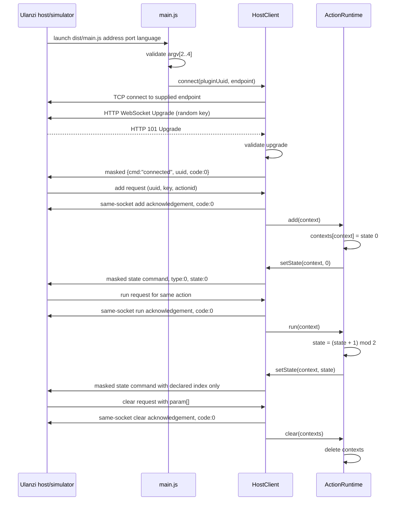

# Technical Design — Native D200 Plugin Scaffold

## Decision summary

Build a minimal UlanziStudio JavaScript plugin as a CommonJS Node 20 process with no npm runtime dependencies. The only runtime I/O is one client WebSocket connection, implemented over `node:net`, to the host address and port supplied in launch arguments. One in-memory action state machine renders two committed PNG states through the legacy `state` command. Build, validation, tests, and ZIP creation use Node built-ins and deterministic local inputs.

This design implements the three change-local specifications and does not introduce a sports provider. The provider boundary required by the broader project belongs to `football-live-score`; defining one here would create a network-shaped abstraction in conflict with D3.

## Scope and constraints

| ID | Constraint | Design consequence |
|---|---|---|
| D1 | CommonJS and zero runtime dependencies | `src/plugin/*.js` uses `require`/`module.exports`; the runtime uses only `node:events`, `node:crypto`, and `node:net`; no bundler or runtime package is introduced. |
| D2 | Automated checks plus simulator recipe; no hardware gate | Offline npm scripts are acceptance gates. Simulator observations are supporting evidence. A physical D200 is never required. |
| D3 | One D200 action, static icon/state, no dynamic SVG or network | The package contains committed PNG files only; runtime sends state indexes only; there is no `fetch`, HTTP client, generated image, API endpoint, or provider module. |
| D4 | No Property Inspector | No inspector directory, manifest path, random/listening port, settings event channel, or pre-shaped inspector asset exists. |

### Explicit non-goals

- TheSportsDB access, polling, caching, credentials, event selection, and live-score presentation.
- Generated SVG, `data:` URI, base64 image, `setImage`, or `setTitle` rendering.
- Property Inspector UI or service communication.
- Reconnection policy, host discovery, production installation, store publication, signing, localization, and hardware verification.
- More than one action, D200 variants, dials, multi-actions, or persisted settings.

## Evidence basis

Claims refer to `research.md`; full excerpts and provenance remain there.

| Design fact | Evidence |
|---|---|
| A `.js` `CodePath` is launched with host Node v20.12.2. | C7 / S2. |
| Address, port, and language are passed as `argv[2..4]`. | C8 / S3. |
| The required manifest fields, JavaScript type, UUID shape, action fields, and D200 targeting are documented. | C2–C5 / S2. |
| Action lifecycle messages use `uuid___key___actionid`. | C9 / S3. |
| Legacy static-state helpers exist independently of V3.1 `setImage`/`setTitle`. | C10–C11 / S3. |
| The vendor SDK is ESM, depends on `ws`, and is not available from npm. | C15–C16 / S1, S4, S6, S7. This supports the confirmed local-protocol choice rather than adding that SDK. |
| Simulator port, plugin placement, refresh, manual service start, and reference-only limitations are documented. | C17–C18 / S5. |
| Production install location is not documented. | C21 / S2; preserved as G1. |
| Property Inspector direct communication requires `RandomPort`; standard host event flow does not. | C13 / S3. D4 removes both surfaces. |
| The exact legacy `state` payload and same-socket request acknowledgement are exercised by the inspected sibling. | `explore.md`, “Host/runtime protocol map”; `/mnt/d/Desarrollo/FlightInfoPlugin/src/plugin/host-client.js` and its exact-payload tests. This is local reference evidence, not a new vendor claim. |

Primary sources used by this design:

- S2: [Ulanzi manifest reference](https://raw.githubusercontent.com/UlanziTechnology/UlanziDeckPlugin-SDK/main/manifest.md)
- S3: [Official plugin-common-node README](https://raw.githubusercontent.com/UlanziTechnology/plugin-common-node/main/README.md)
- S4: [Official plugin-common-node package.json](https://raw.githubusercontent.com/UlanziTechnology/plugin-common-node/main/package.json)
- S5: [UlanziDeck Simulator README](https://raw.githubusercontent.com/UlanziTechnology/UlanziDeckPlugin-SDK/main/UlanziDeckSimulator/README.md)
- S7: [npm registry lookup for ulanzideck-api](https://registry.npmjs.org/ulanzideck-api) (HTTP 404 at research time)

TheSportsDB claims C22–C40 are deliberately unused. Their presence in research does not authorize API access in this change.

## Exact assumptions

These assumptions are testable boundaries, not statements that missing vendor behavior has been proven.

| ID | Exact assumption | Handling if false |
|---|---|---|
| A1 | The host launches `dist/main.js` with non-empty address and language plus an integer port in `1..65535`, in `argv[2]`, `argv[3]`, and `argv[4]`. | Fail before opening a socket; do not apply documented defaults because the runtime spec requires fail-fast behavior. |
| A2 | Host requests are JSON WebSocket text messages with `cmd`, `uuid`, `key`, and `actionid`; their context is `uuid___key___actionid`; valid requests are acknowledged on the same socket before local dispatch. | Reject malformed input without state mutation; a simulator mismatch is recorded against A2 rather than patched by guessing. |
| A3 | The manifest contract and UUID rules in C2–C5 are accepted by the target host. | `check` enforces the documented contract; an observed simulator rejection is evidence for a new decision. |
| A4 | `Banner` and `Detail` are unnecessary because they are absent from the primary manifest field tables. | Preserve the simulator failure as evidence; do not add either key silently. |
| A5 | Omitting `PropertyInspectorPath` is valid for this action. | A simulator failure is recorded; no inspector is added inside this change. |
| A6 | The simulator accepts a manually started Node service connecting to `127.0.0.1:39069`, but remains partial and reference-only. | Automated checks remain authoritative; no hardware or undocumented production path is substituted. |
| A7 | A bounded RFC 6455 text-frame subset over `node:net` is sufficient for this local host protocol. | A host incompatibility is a design-decision trigger; adopting `ws` or the vendor SDK requires explicit consent and a separate change. |
| A8 | No TheSportsDB behavior is needed or used. | Any request for live data is deferred to `football-live-score`. |
| DA1 | Default identity is package folder `com.ulanzi.sportboard.ulanziPlugin`, plugin UUID `com.ulanzi.ulanzistudio.sportboard`, action UUID `com.ulanzi.ulanzistudio.sportboard.status`, display name `Sport Board`, author `SportBoardPlugin Contributors`, and version `0.1.0`. | These are replaceable before change 2, but one atomic identity change must update manifest, package metadata, constants, checks, and tests. |
| DA2 | The action has exactly two committed PNG states, `Ready` at index 0 and `Selected` at index 1. `run` cycles `0 → 1 → 0`; `add` explicitly selects state 0. | If the host treats indexes differently, capture the simulator payload/result and revise the state contract; do not switch to dynamic rendering. |
| DA3 | One complete JSON host message occupies one text message; TCP chunks may split or coalesce WebSocket frames. Server text, ping, pong, and close frames are sufficient; fragmented data messages and payloads above 1 MiB are not required. | Unsupported or oversized frames close the boundary with a protocol error; they are not partially interpreted. |
| DA4 | WebSocket upgrade responses are standards-shaped HTTP 101 responses. Client text and pong frames must be masked; server frames are expected to be unmasked. | Invalid upgrade or frame shape closes the socket and surfaces a sanitized error. |
| DA5 | The committed PNG bytes are source artifacts, never generated by runtime, build, or package scripts. | Missing or non-PNG assets fail `check`. |

## Architecture

```text
Ulanzi host / simulator
        │ one local TCP socket; HTTP Upgrade + WebSocket text frames
        ▼
src/plugin/host-client.js
  launch args ─ socket ownership ─ frame codec ─ request ACK ─ state command
        │ typed events and setState(context, index)
        ▼
src/plugin/action-runtime.js
  Map<context, stateIndex> ─ declared-action guard ─ add/run/clear lifecycle
        ▲
        │ composition, constants, process signals
src/plugin/main.js

Committed package metadata/assets ── scripts/build.mjs ──► package-folder/dist/
                package folder + dist ─ scripts/package.mjs ─► package/*.zip
                all source surfaces ─── scripts/check.mjs + node:test
```

### Runtime module contracts

#### `src/plugin/main.js`

Responsibilities:

1. Call `parseLaunchArgs(process.argv)` and set a clear non-zero exit status on failure.
2. Construct one `HostClient` and one `ActionRuntime` with compile-time identity constants.
3. Register `add`, `run`, and `clear` handlers before connecting.
4. Connect exactly once to the supplied host endpoint.
5. On `SIGINT`/`SIGTERM`, dispose the client and clear static in-memory state.
6. Log only short lifecycle/error categories to stderr; never log raw frames or payloads.

It exports `start({ argv, connect, randomBytes, stderr })` for tests and runs only under `require.main === module`. Injection is a test seam; production defaults remain Node built-ins.

#### `src/plugin/host-client.js`

This module is the sole network boundary. No other runtime module imports a networking built-in.

Exports:

- `parseLaunchArgs(argv) -> { address, port, language }`
- `createUpgradeRequest({ address, port, key }) -> Buffer`
- `parseUpgradeResponse(buffer, key) -> { remainder }`
- `encodeClientFrame(payload, { opcode, mask }) -> Buffer`
- `decodeServerFrames(buffer) -> { frames, remainder }`
- `encodeContext({ uuid, key, actionid }) -> string`
- `decodeContext(context) -> { uuid, key, actionid }`
- `createAck(request, pluginUuid) -> object`
- `createStateCommand(pluginUuid, context, stateIndex) -> object`
- `HostClient`, an `EventEmitter`-compatible transport owner

Boundary rules:

- A client owns at most one socket and never calls `listen`, `createServer`, DNS helpers, HTTP clients, `fetch`, or a second connector.
- The HTTP upgrade accumulator is capped at 16 KiB. The response must be status 101 with compatible upgrade headers and the expected `Sec-WebSocket-Accept` derived from the request key.
- The frame decoder retains incomplete bytes across TCP chunks and processes coalesced frames in order. Payload length is capped at 1 MiB before allocation/dispatch.
- Text frames are UTF-8 JSON. Ping receives a masked pong on the same socket. Close ends dispatch. Unsupported binary or fragmented data frames are protocol errors.
- Every syntactically valid host request is acknowledged before its event is emitted. Responses and commands use the socket that received the request.
- Socket error, malformed upgrade, invalid frame, and close are emitted once; no implicit reconnect or endpoint fallback occurs.
- `sendObject` returns `false` unless the upgrade is complete and the socket is writable. It never queues unbounded output.

Exact application payloads:

```json
{"cmd":"connected","uuid":"com.ulanzi.ulanzistudio.sportboard","code":0}
```

For a valid request, acknowledgement is the request envelope with `code: 0`, sent under the same `cmd`; fields needed by the host are preserved. The host client then appends the derived `context` only to the local event object. For `clear`, context is derived per `param[]` item.

```json
{
  "cmd": "state",
  "uuid": "com.ulanzi.ulanzistudio.sportboard",
  "param": {
    "statelist": [{
      "uuid": "<decoded uuid>",
      "key": "<decoded key>",
      "actionid": "com.ulanzi.ulanzistudio.sportboard.status",
      "type": 0,
      "state": 1,
      "textData": "",
      "showtext": false
    }]
  }
}
```

Only `type: 0` is legal in this change. There is no method for path, base64, title, or image rendering.

#### `src/plugin/action-runtime.js`

`ActionRuntime({ host, actionUuid, stateCount: 2 })` owns `Map<context, { stateIndex }>`.

| Event | Preconditions | Transition | Host effect |
|---|---|---|---|
| `add` | Decoded `actionid` equals the declared action UUID. | Insert or reset context to state 0. | Send declared state 0. |
| `run` | Declared action; if absent, create at state 0 to tolerate a simulator session that omitted `add`. | Advance modulo 2. | Send the resulting declared state index. |
| `clear` | Zero or more per-item contexts. | Delete each matching context. | None beyond the host-client acknowledgement. |
| Any other/undeclared action | None. | No mutation. | No state command. The transport still acknowledges a valid request. |
| Process/socket disposal | Any. | Clear the map. | No outbound network. |

State is process-local, contains no user or API data, and is never persisted. Restarting the service or reconnecting begins at state 0. There are no timers, polling loops, settings, files, environment variables, or clocks in the lifecycle.

## Host connection and action sequence



## Package and manifest design

### Committed layout

```text
package.json
README.md
.gitignore
src/plugin/
  main.js
  host-client.js
  action-runtime.js
scripts/
  check.mjs
  build.mjs
  package.mjs
com.ulanzi.sportboard.ulanziPlugin/
  manifest.json
  assets/
    plugin.png
    action.png
    ready.png
    selected.png
test/
  host-client.test.js
  action-runtime.test.js
  toolchain.test.js
```

Generated and ignored:

```text
com.ulanzi.sportboard.ulanziPlugin/dist/   # clean copy of src/plugin
package/com.ulanzi.sportboard.ulanziPlugin.zip
node_modules/
```

There is no `property-inspector/`, provider, settings, SVG, store metadata, or generated image directory.

### Manifest contract

The manifest contains only required documented top-level fields and action fields needed by this design, plus documented device/controller/state-control options:

- Top-level: `Author`, `Name`, `Icon`, `Version`, `CodePath`, `Type`, `UUID`, `Actions`.
- Action: `Name`, `Icon`, `UUID`, `States`, `DisableAutomaticStates`, `Controllers`, `Devices`.
- `CodePath` is `dist/main.js`; `Type` is `JavaScript`.
- `Devices` is exactly `["D200"]`; `Controllers` is exactly `["Keypad"]`.
- `DisableAutomaticStates` is `true`, because the runtime explicitly chooses a state.
- `States` is exactly `[Ready, Selected]`, each referencing its committed PNG.
- `Banner`, `Detail`, `MinimumVersion`, `PropertyInspectorPath`, and all undocumented keys are rejected.
- `Software.MinVersion` is omitted: it is optional, and choosing a value would not resolve G3.

## Deterministic toolchain

`package.json` is private, version `0.1.0`, has `engines.node: ">=20"`, has no `dependencies` or `devDependencies`, and defines:

| Script | Exact command contract | Side effects |
|---|---|---|
| `check` | `node scripts/check.mjs` | Read-only. |
| `test` | `node --test test/*.test.js` | Test-runner output only. |
| `build` | `node scripts/build.mjs` | Atomically replaces only the package folder's ignored `dist/`. |
| `package` | `npm run check && npm test && npm run build && node scripts/package.mjs` | Atomically replaces only the ignored ZIP under root `package/`. |

All paths are derived from `import.meta.url`, not the caller's current working directory. Directory walks and ZIP entries are sorted by normalized POSIX path. Scripts use synchronous Node built-ins to avoid scheduling-dependent output.

### `check.mjs`

The checker exports pure validators for tests and, when executed, reports all found defects in stable path/rule order before exiting non-zero. It verifies:

1. `package.json` parses, Node is `>=20`, required scripts are exact, version matches the manifest, and runtime dependency sets are absent/empty.
2. Manifest required/allowed keys, fixed `Type`/`CodePath`, four-segment plugin UUID, extending action UUID, exactly one action, exact D200/keypad targeting, two valid states, and absent forbidden keys.
3. Every manifest path is relative, stays within the package root, exists with exact casing, and resolves to a committed `.png` file where it is an image.
4. No `property-inspector` directory, `.svg` package asset, `data:image` source token, V3.1 `setImage`/`setTitle`, base-data image helper, or generated-art path exists.
5. Only `host-client.js` may import `node:net`; runtime source may not import HTTP(S), TLS, DNS, datagram, or other network clients, call `fetch`, or create/listen on a server socket.
6. `node --check` succeeds for every sorted `src/plugin/*.js` file. Script files are loaded by tests and execute under Node 20 ESM.
7. A conservative secret-pattern scan finds no credential-shaped values. This is defense in depth, not proof that arbitrary text is non-secret.

### `build.mjs`

The build copies the three CommonJS source files into a temporary sibling directory, verifies the expected file set, then replaces `<plugin>/dist/` by rename. It removes its temporary directory on failure. It copies file bytes only; it does not transform, bundle, fetch, or generate assets. A clean replacement prevents stale runtime files from surviving repeated builds.

### `package.mjs`

The package script implements a small ZIP32 “store” writer with no compression. Its testable seams are `crc32`, `collectEntries`, and `createZip(entries)`. It:

1. Collects the package folder after build, excluding generated package output.
2. Normalizes and sorts relative paths, rejects traversal/absolute names, and prefixes every entry with `com.ulanzi.sportboard.ulanziPlugin/`.
3. Uses fixed DOS timestamp/date fields, fixed flags and permissions, CRC32, and source bytes; it emits no environment-specific absolute path or current timestamp.
4. Rejects ZIP64-sized inputs instead of producing an ambiguous archive.
5. Creates bytes in memory, verifies central-directory entry names/root, writes a temporary ZIP, then renames it over the target.

Equivalent source trees therefore produce byte-identical ZIPs, not merely archives with equivalent content.

## Test seams and verification matrix

All automated tests use `node:test` and `node:assert/strict`. No test opens a real socket, accesses hardware, reads credentials, or reaches an API.

| Surface | Seam/evidence |
|---|---|
| Launch arguments | Valid triple; missing address/port/language; non-numeric/out-of-range port; exact endpoint passed to injected connector. |
| Upgrade | Deterministic injected key; exact request bytes; split response accumulation; invalid status/header/accept rejection; bytes after headers preserved for frame parsing. |
| Frame codec | Injected fixed mask; text lengths around 125/126; partial and coalesced frames; ping/pong; close; malformed, fragmented, binary, and oversized rejection. |
| Request protocol | Connected payload; valid request ACK occurs before event dispatch; same fake socket receives ACK and state; invalid JSON cannot mutate action state. |
| Context | Round-trip valid context; reject missing/extra separator components. |
| State command | Exact deep equality with the `type:0` payload; state bounds reject negative, non-integer, or index 2. No image-capable method exists. |
| Lifecycle | `add → state 0`, repeated `run → 1 → 0`, run-before-add fallback, clear, duplicate add reset, undeclared action no-op, dispose reset. |
| Manifest/check | Pure validation fixtures for missing/unknown fields, malformed UUIDs, wrong device, missing/traversing assets, forbidden inspector/SVG/dynamic/network tokens, and version drift. |
| Build | Temporary fixture proves stale output removal and byte-for-byte copy with no extra files. |
| ZIP | Sorted root names, CRC values, fixed metadata, repeat byte equality, no absolute paths, and manifest at plugin-folder root. |

The test connector is dependency injection into `start`/`HostClient`; it is not a second production transport. Runtime defaults always resolve to `node:net.connect`.

## Simulator verification

The README presents this as a manual evidence recipe, never an acceptance gate.

```mermaid
sequenceDiagram
    actor R as Reviewer
    participant N as npm scripts
    participant F as Local filesystem
    participant S as UlanziDeck Simulator :39069
    participant P as Plugin main service

    R->>N: npm run check && npm test
    N-->>R: deterministic offline pass
    R->>N: npm run build && npm run package
    N->>F: dist/ and rooted ZIP
    R->>F: inspect ZIP root and copy package to Simulator/plugins
    R->>S: npm install; npm start; open 127.0.0.1:39069
    R->>S: Refresh Plugin List
    S-->>R: one Sport Board action is listed
    R->>P: node .../dist/main.js 127.0.0.1 39069 en
    P->>S: one local WebSocket connection
    R->>S: drag action onto a D200 key
    S->>P: add request
    P->>S: state 0 (Ready PNG)
    R->>S: manually inject/run key event
    S->>P: run request
    P->>S: state 1, then state 0 on next run
    R->>R: record observation and simulator limitations
```

The recipe must say that the simulator does not actively send `setactive`, may require manual event injection and service start, has incomplete host behavior, and treats desktop behavior as the source of truth (C17–C18/S5). It must not claim a production install path (G1) or successful physical D200 behavior.

## Failure boundaries

| Failure | Boundary behavior | User/reviewer signal | Recovery |
|---|---|---|---|
| Missing/invalid launch args | No socket is opened; startup sets non-zero exit status. | One sanitized argument error. | Relaunch with host-supplied values. |
| TCP refusal/error | Client emits one error and disposes the socket; no fallback endpoint or retry. | Sanitized local-host connection error. | Start/verify simulator or host, then relaunch. |
| Invalid upgrade | Destroy socket before sending `connected`. | Protocol-upgrade error. | Record host/simulator evidence against DA4/A7. |
| Malformed/oversized frame | No partial dispatch; close/destroy boundary. | Protocol-frame error without raw payload. | Relaunch after correcting host compatibility. |
| Invalid JSON or non-request response | Ignore without state mutation or response loop. | Test/debug category only; no payload log. | Correct sender; no repository mutation. |
| Unknown command/action/context | ACK valid host request; action runtime does nothing. | No state transition. | Check manifest/action identity. |
| State index defect | Reject before encoding. | Deterministic local error/test failure. | Fix state-machine/manifest mismatch. |
| Build copy failure | Remove staging directory; leave last completed `dist/` untouched where possible. | Script exits non-zero with local path. | Correct filesystem issue and rerun. |
| Package overflow/path/CRC/layout defect | Do not replace the prior ZIP. | Script exits non-zero naming deterministic rule. | Correct inputs and rerun. |
| Simulator manifest rejection | Do not add undocumented fields automatically. | Record host version, error, and violated assumption. | Return to design/proposal decision. |
| Any request for API/PI/dynamic image | Refuse scope expansion in this change. | D3/D4 trace in review. | Propose a separate authorized change. |

No failure path opens a second connection, starts a listening socket, exposes a secret, writes persistent state, or falls back to hardware.

## Security and privacy boundary

- The only remote endpoint is exactly `{address, port}` from validated host launch arguments; the plugin neither discovers nor rewrites it.
- No API key, credential field, URL, request body, user setting, or persistent data exists.
- Logs omit raw host messages and frame bytes.
- Asset resolution and archive names reject traversal and absolute paths.
- Frame and handshake caps prevent unbounded buffering from malformed local input.
- There is no inbound listening socket or browser surface.

## Requirement traceability

| Specification requirement | Design section |
|---|---|
| Package folder, fields, identity, one D200 action, static assets | Package and manifest design; DA1–DA2. |
| Launch args and built-in-only host connection | Runtime contracts; A1/A7; host sequence. |
| Action lifecycle and static rendering | Action runtime contract; exact state payload. |
| No network beyond host; no Property Inspector | Scope constraints; sole network boundary; security boundary. |
| Offline deterministic scripts | Deterministic toolchain. |
| Pure seams and exact payload tests | Test seams and verification matrix. |
| Rooted ZIP and ignored outputs | Layout; package script design. |
| Honest simulator recipe | Simulator verification. |
| No secrets and rollback compatibility | Security boundary; rollback. |

## Carried unknowns

These remain exact and unresolved:

- **G1:** Production install directory path is undocumented (C21); only auto-detection after install to a “designated folder” is documented. This design states no production sideload path and uses no hardware gate.
- **G2:** No official caching policy statement exists in the retrieved corpus (C40). This design has no network, cache, or polling path; change 2 must bind polling to documented limits without inventing a cache TTL.
- **G3:** The installed UlanziStudio version is unknown, so V3.1 command availability (3.3.0+) cannot be established. This design excludes `setTitle` and `setImage` and uses only static state indexes.

A4 and A6 also remain evidence-qualified assumptions. U5, U6, U7, and U10 are not resolved by this design.

## Rollback and delivery risk

Rollback is repository-only because nothing is published, installed, registered, emailed, or persisted externally.

1. A partial implementation slice can be reverted by removing only its added source/configuration files and ignored outputs. No data migration or runtime registration must be undone.
2. A full revert removes `package.json`, README, scripts, tests, source, package folder, and generated ignored outputs, and restores the original `.gitignore`. The repository returns to its OpenSpec bootstrap state and strict TDD again fails closed.
3. Simulator copies, if a reviewer made them manually, are disposable local verification artifacts and are not part of delivery. The README must identify them as such.
4. If the local protocol proves incompatible, rollback is preferred over silently adding `ws`, vendoring the SDK, enabling dynamic rendering, or adding undocumented manifest fields. Those are separate consent-bearing decisions.

The expected implementation remains above the canonical 400 changed-line review budget. Under `ask-on-risk`, design does not select a chain strategy or infer `size:exception`; the orchestrator must pause for a delivery decision once implementation sizing is known. This document defines architecture and review seams only, not tasks.
